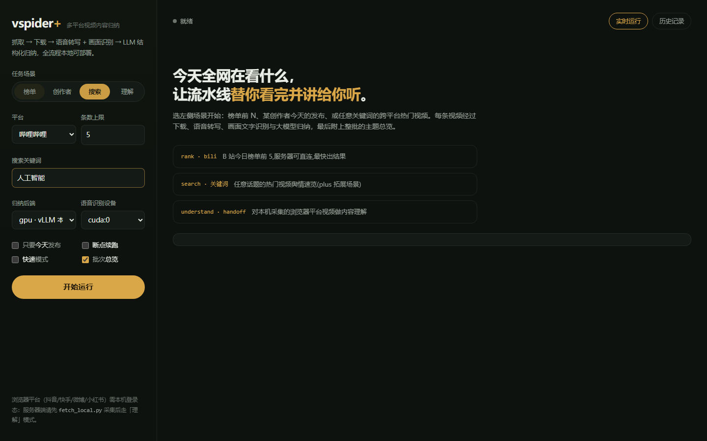
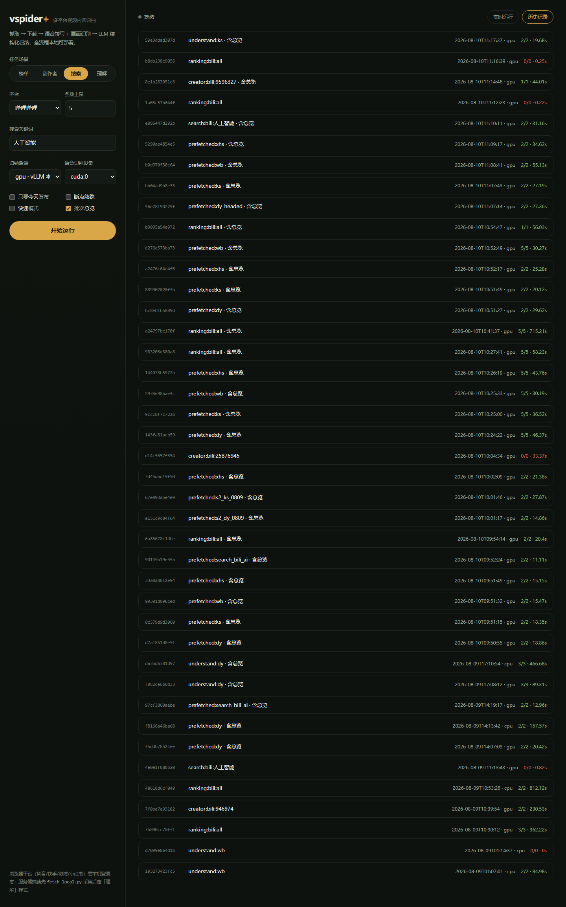
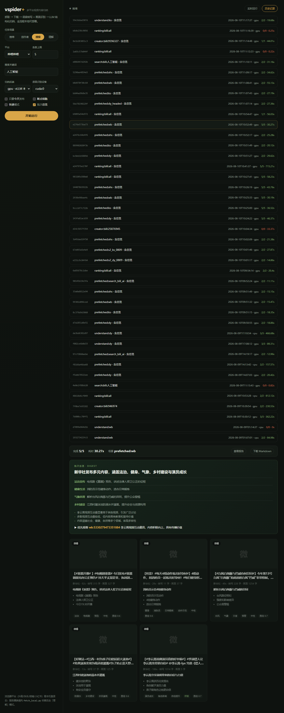
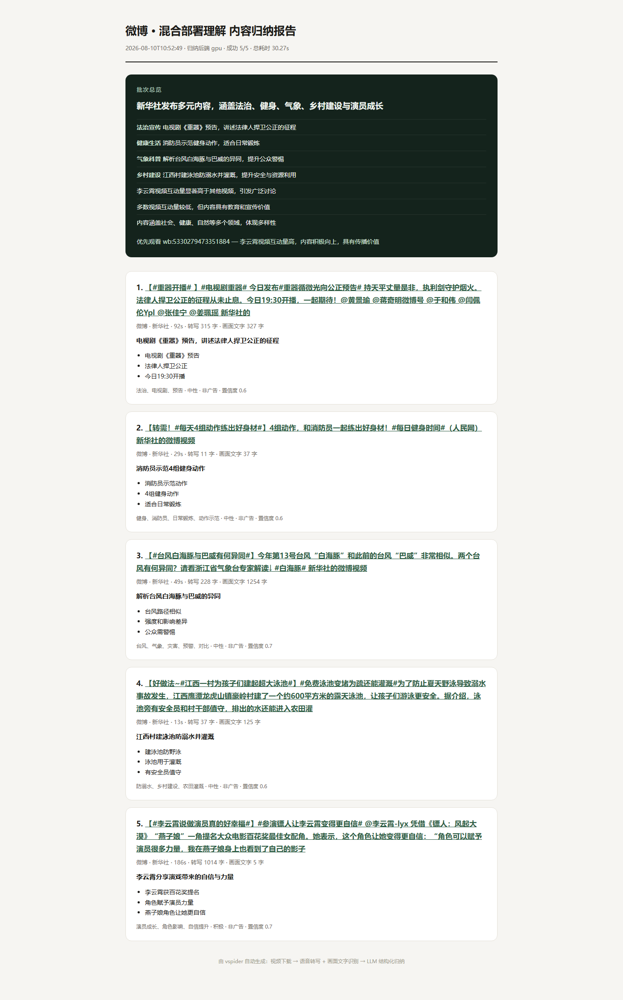

# VSpider

五个平台的视频采集、下载和内容归纳工具，支持 B站、抖音、快手、微博和小红书。

老师题目里的两种用法都能直接跑：

- 查看当前榜单前 N 条，下载视频并归纳内容
- 获取指定创作者今天发布的视频，下载并归纳内容

另外加了关键词搜索、整批热点总览、历史记录、断点续跑、Web 页面和报告导出。



## 处理流程

```text
平台发现 -> 视频下载 -> 音频抽取 -> SenseVoice ASR
                         -> 关键帧 -> RapidOCR
标题 / 作者 / 互动数据 ----------------------> Qwen 结构化归纳
                                              -> SQLite / 总览 / 报告
```

单条视频会输出：

- 一句话摘要
- 3～5 个内容要点
- 话题、情感倾向、广告判断
- 置信度
- ASR、OCR、下载和归纳耗时

2026-08-10 使用 RTX 4090 做过一次完整验收：

- 五平台当前榜单前5：25/25
- 五平台创作者场景：12/12
- 五平台搜索“人工智能”：10/10
- 合计 47 条 GPU 结果，47/47 成功

详细记录在 `docs/EXPERIMENTS.md`。

## 1. 本机安装

需要 Python 3.11+、Git 和 ffmpeg。

```bash
git clone https://github.com/Jianbin-Zhao/pku-video-digest.git
cd pku-video-digest
python scripts/setup_local.py
```

`setup_local.py` 会把测试过的 MediaCrawler 版本克隆到项目同级目录，并安装
Playwright Chromium。项目不会修改 MediaCrawler 源码。

安装完成后先检查环境：

```bash
python scripts/preflight.py --side collect
```

所有项目显示 `[OK]` 后再继续。

### 配置 `.env`

复制 `.env.example` 为 `.env`，按需要填写：

```env
DASHSCOPE_API_KEY=
DASHSCOPE_BASE_URL=https://dashscope.aliyuncs.com/compatible-mode/v1

VSPIDER_SSH_HOST=
VSPIDER_SSH_PORT=22
VSPIDER_SSH_USER=root
VSPIDER_SSH_PASSWORD=
```

`.env`、浏览器 Cookie、视频、模型和数据库都已在 `.gitignore` 中排除。

## 2. 登录平台

四个浏览器平台共用持久化登录目录，通常只需扫一次：

```bash
python scripts/login.py dy ks wb xhs
```

B站榜单和搜索可以匿名访问，创作者空间接口建议单独登录：

```bash
python scripts/login_bili.py
```

Cookie 会写入本机 `.env`，不会打印到终端。

## 3. GPU 理解端

服务器安装理解依赖：

```bash
pip install -e ".[asr,ocr,serve]"
```

下载 ASR 模型：

```bash
modelscope download --model iic/SenseVoiceSmall \
  --local_dir /root/autodl-tmp/models/SenseVoiceSmall

modelscope download --model iic/speech_fsmn_vad_zh-cn-16k-common-pytorch \
  --local_dir /root/autodl-tmp/models/fsmn-vad
```

本项目默认 GPU 档为 Qwen3-8B-AWQ + vLLM：

```bash
bash scripts/vllm_restart.sh
python scripts/preflight.py --side understand --profile gpu --device cuda:0
```

24GB 显卡默认给 vLLM 使用 75% 显存，SenseVoice 同时使用 GPU；12GB 显卡默认
给 vLLM 使用 85%，ASR 建议改成 `--device cpu`。

## 4. 榜单前5

### B站直接运行

```bash
vspider rank \
  --platform bili \
  --limit 5 \
  --profile gpu \
  --device cuda:0
```

默认跳过超过30分钟的视频，防止演示被超长视频拖住。需要严格保持原榜单第1～5名：

```bash
vspider rank --platform bili --limit 5 --max-duration 0 \
  --profile gpu --device cuda:0
```

验收时榜首视频长107分钟，完整流程可以跑通，但下载本身用了约11分钟。

### 抖音、快手、微博、小红书

这四个平台在本机采集更稳：家庭网络和真实浏览器登录态不容易触发机房 IP 风控。

```bash
python scripts/fetch_local.py xhs --limit 5 \
  --out-dir data/handoff/rank_xhs

python tools/remote.py put data/handoff/rank_xhs \
  /root/autodl-tmp/data/handoff/rank_xhs

python scripts/understand.py \
  /root/autodl-tmp/data/handoff/rank_xhs \
  --profile gpu --device cuda:0 \
  --digest --persist --report report.html
```

把 `xhs` 换成 `dy`、`ks` 或 `wb` 即可。

## 5. 创作者今日视频

B站：

```bash
vspider creator --platform bili --id <mid> --today \
  --max-duration 0 --profile gpu --device cuda:0
```

浏览器平台：

```bash
python scripts/fetch_local.py wb \
  --creator <用户ID> --today \
  --out-dir data/handoff/creator_wb
```

如果作者当天没有投稿，会生成空的 `items.json` 并正常退出，不会把历史视频混进来。

## 6. 关键词搜索

B站可以一条命令跑完：

```bash
vspider search --keyword 人工智能 --platforms bili \
  --limit 2 --profile gpu --device cuda:0
```

浏览器平台仍建议先在本机下载：

```bash
python scripts/fetch_local.py ks --keyword 人工智能 --limit 2
python scripts/fetch_local.py dy --keyword 人工智能 --limit 2 --show-browser
```

抖音连续测试较多时，无头搜索可能只返回空列表；加 `--show-browser` 使用真实窗口更稳。

## 7. Web 页面

先启动 vLLM，再启动 Web：

```bash
bash scripts/vllm_restart.sh
bash scripts/serve_web.sh 6006
```

本机通过 SSH 隧道访问：

```bash
ssh -p <SSH端口> -L 6006:127.0.0.1:6006 root@<服务器地址>
```

浏览器打开 `http://127.0.0.1:6006`。

页面支持实时进度、结果卡片、整批总览和历史回看：





每次运行都可以导出自包含 HTML 或 Markdown：



命令行也能导出：

```bash
vspider report latest --format html -o report.html
vspider report <run_id> --format md
```

## 8. 三种归纳后端

- `--profile api`：调用 DashScope，配置简单，适合调试
- `--profile gpu`：vLLM + Qwen3-8B-AWQ，本地 GPU 归纳
- `--profile cpu`：llama.cpp + Qwen2.5-3B-GGUF，无显卡也能运行

三种后端都使用 OpenAI 兼容接口，采集和处理代码不需要变化。

## 9. 常用选项

```text
--fast             转写内容足够时跳过 OCR
--digest           生成整批热点总览
--resume           跳过 SQLite 中已经成功处理的视频
--max-duration 0   不限制视频长度
--show-browser     显示真实浏览器窗口
--out result.json  保存结构化结果
```

断点续跑实测可在0.2秒内跳过已处理视频。

## 目录

```text
vspider/
  discovery/       五平台发现与字段统一
  download/        yt-dlp 和直链下载
  asr/ ocr/        SenseVoice、RapidOCR
  pipeline/        并发编排、事件、重试
  summarize/       单条归纳和批次总览
  web/             FastAPI、SSE、前端

scripts/           安装、登录、采集、理解和测试脚本
tools/remote.py    SSH 执行与文件同步
docs/              设计、实验和进度记录
```

## 已知限制

平台接口和风控会变化，登录过期时需要重新扫码。代码提供了重试、熔断和清晰的错误信息，
但无法保证第三方平台永远不调整接口。

如果榜单、搜索或创作者请求突然返回空结果，先运行：

```bash
python scripts/verify_all.py
```

确认是登录失效、平台限流还是实际没有内容，再决定是否重新登录。
